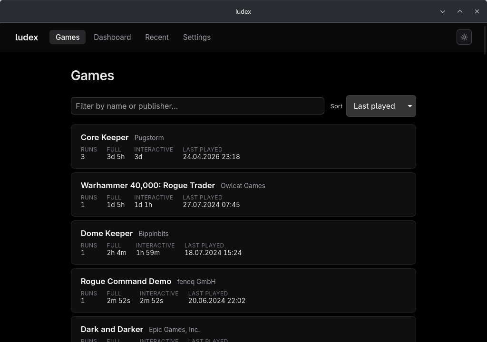
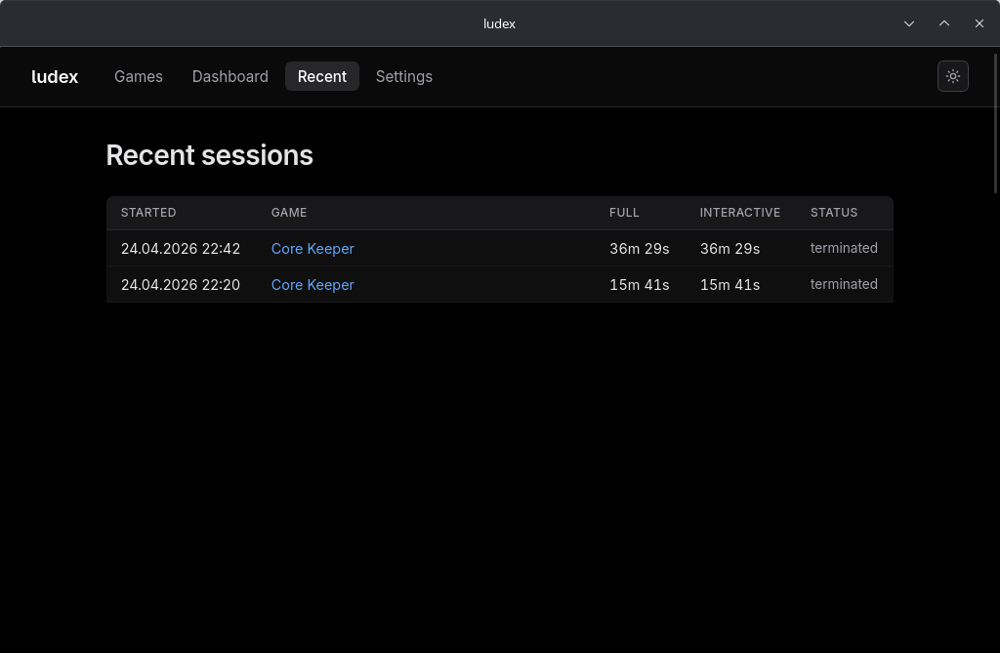
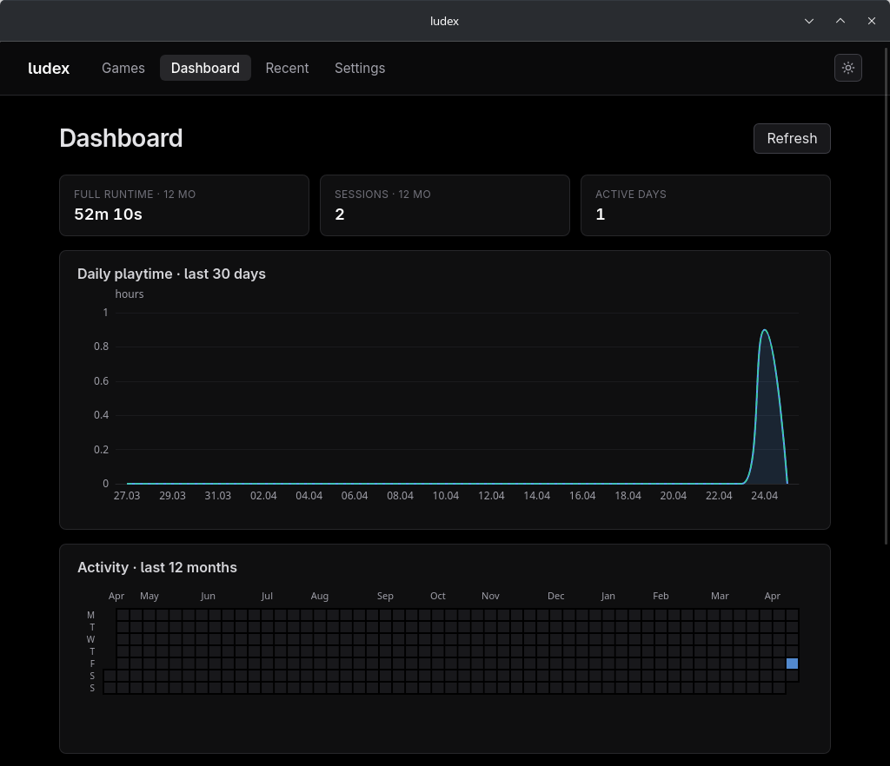
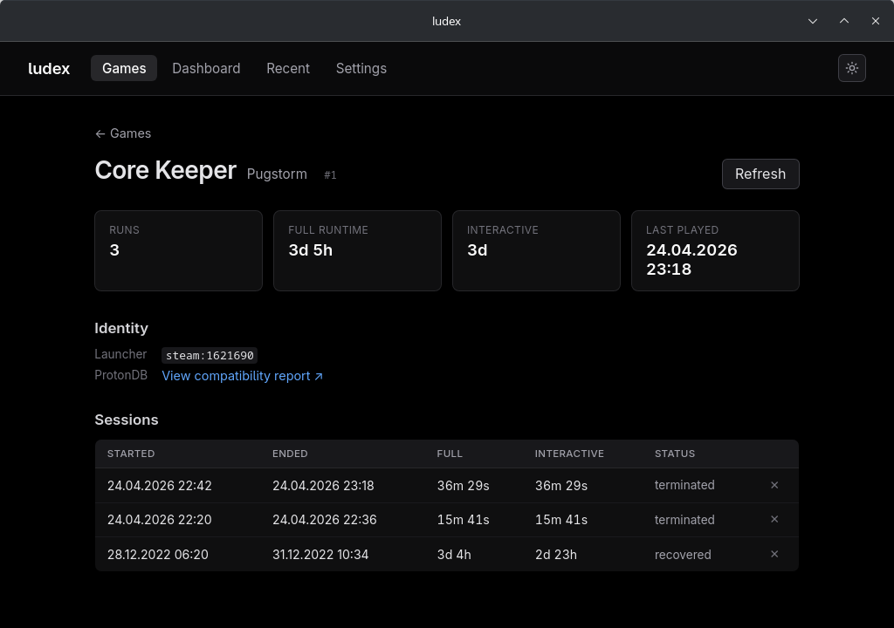

<p align="center">
  
  
</p>

<h1 align="center">ludex</h1>

<p align="center">A launcher-agnostic playtime tracker for Linux.</p>

**Status: 0.2.0.** Daemon, CLI, and Tauri GUI all build and run end-to-end. Steam-launched sessions are detected and recorded; the Wayland foreground-window fallback catches games launched outside any recognised launcher on KDE Plasma 6, including Lutris- and Heroic-managed wine/Proton prefixes (Heroic-launched games are keyed by `HEROIC_APP_NAME` so the row stays stable across wine/Proton variant switches). The GUI covers the apps list, recent sessions, per-application detail (with a ProtonDB link for Steam games), an ECharts dashboard, settings (detection thresholds, alt-tab grace, cutscene grace, backup configuration), and a system tray with close-to-tray. Adjacent same-application sessions split by a short alt-tab are merged at display time. No released binaries yet.

## What it does

ludex records time spent playing games on Linux without requiring per-game configuration. The daemon observes game launches from:

- **Steam** via inotify on the Steam content log *(shipped)*
- **Lutris-managed games** via the foreground-window source — Lutris itself exposes no start/stop signals, but its `pga.db` is read on enrichment to give games their proper names; Battle.net's catalogue (WoW, Diablo, Overwatch, etc.) is curated by executable basename *(shipped)*
- **Heroic Games Launcher** (Epic, GOG, Amazon Prime libraries) via the foreground-window source — Heroic doesn't expose a lifecycle signal either, but Heroic-launched processes inherit `HEROIC_APP_NAME`, which the daemon uses to key the session against Heroic's own canonical id and look up the title from the runner-specific store caches under `~/.config/heroic/store_cache/`. Survives the user switching wine/Proton variants for the same game *(shipped)*
- **Anything else** via a Wayland foreground-window fallback gated on loaded graphics libraries and DRM fdinfo GPU-usage metrics *(shipped on KDE Plasma 6 Wayland)*

Each recognised game has its sessions persisted to SQLite with two runtime figures: **full runtime** (wall-clock session duration) and **interactive runtime** (full runtime minus billable idle intervals via `logind.IdleHint`, with a configurable cutscene-grace window so non-skippable cutscenes and dialogue trees aren't read as "user stepped away").

The primary target is KDE Plasma 6 on Wayland. X11 support is on the roadmap (the gate code already expects an `_NET_ACTIVE_WINDOW` source) but no X11 foreground source is wired up today — on X11 the launcher-based paths (Steam log tailing) still work, but the foreground fallback does not.

## Screenshots

| | |
|---|---|
|  |  |
| **Games** — every tracked application, sortable by last played / name / total runtime. | **Recent sessions** — chronological feed of the latest plays. |
|  |  |
| **Dashboard** — daily playtime line, calendar heatmap, sessions-this-week bar (ECharts). | **Game detail** — per-game stats, ProtonDB link for Steam titles, full session history with merged-fragment annotations and per-row delete. |

## Design principles

- **No telemetry.** No network I/O at runtime, full stop.
- **Minimal required permissions.** Unprivileged user account, session D-Bus only, no `input`/`video` group, no `sudo`.
- **Event-driven by preference.** Filesystem watches, D-Bus signals, `pidfd` waits. Polling is reserved for GPU-usage sampling of a single foreground process.
- **Separation of detection from identification.** The detector answers "is this a game?" with a small, fast gate; identification is a separate metadata cascade that can be wrong without breaking session tracking.
- **Structured logs, migration-backed storage, property-tested parsers** from the first commit.

## Architecture

- Rust daemon (`ludex-daemon`): tokio for async, zbus for D-Bus, sqlx for SQLite, tracing for structured logs. Designed to run as a `systemctl --user` service.
- Tauri 2 + SvelteKit + ECharts GUI (`ludex-gui`): apps list, recent sessions, per-app detail, dashboard, settings, system tray. Dark-mode toggle with OLED-friendly palette.
- CLI (`ludex`): operator tool — `doctor`, `apps list`, `sessions`, `backup {now,list,prune,restore}`, `merge`.
- D-Bus IPC over `net.ludex.Tracker1` on the user session bus. Wire types in the dedicated `ludex-dbus-types` crate.

Full design in [docs/architecture.md](docs/architecture.md); phased
plan + current backlog in [docs/roadmap.md](docs/roadmap.md); CLI
reference in [docs/cli.md](docs/cli.md).

## Repository layout

```
Cargo.toml            # Rust workspace manifest
rust-toolchain.toml   # pinned toolchain version
crates/
  ludex-core/         # shared types, schema, SQL, errors, backup engine
    migrations/       # SQLite schema migrations (sqlx::migrate!)
  ludex-daemon/       # the tracker (binary)
  ludex-cli/          # CLI client (binary)
  ludex-enrich/       # metadata enrichment cascade (desktop/Steam/GOG/PE)
  ludex-dbus-types/   # wire types shared by daemon and GUI
app/
  src/                # SvelteKit frontend (TypeScript + Svelte 5)
  src-tauri/          # Tauri 2 host binary
packaging/            # systemd --user unit; PKGBUILD planned
docs/                 # architecture, roadmap, CLI reference
.github/workflows/    # fmt, clippy, test, frontend, cargo-deny
```

## Prerequisites

- **Rust** — pinned in `rust-toolchain.toml`. Use `rustup` to install the matching toolchain automatically.
- **WebKitGTK 4.1 + JavaScriptCoreGTK 4.1** for the Tauri webview. On Arch: `pacman -S webkit2gtk-4.1`.
- **pnpm** for the frontend bundle.
- A Wayland session running **KDE Plasma 6** if you want the foreground-window fallback to work. The Steam-log path is desktop-agnostic and runs anywhere.

The tray uses `ksni` (pure-Rust StatusNotifierItem); no `libappindicator`-shaped C dep needed.

## Running from source

For day-to-day development. Daemon and GUI in two terminals:

```sh
# Terminal 1 — daemon, foreground (Ctrl-C to stop).
cargo run -p ludex-daemon

# Terminal 2 — GUI with hot-reload on Svelte edits.
cd app && pnpm install      # one-off; lockfile is committed
cd app && pnpm tauri dev
```

CLI commands run directly from the workspace too:

```sh
cargo run -p ludex-cli -- doctor
cargo run -p ludex-cli -- apps list
cargo run -p ludex-cli -- sessions --since 1d
```

If you also have a daemon installed via the systemd unit below, stop it first so two daemons aren't fighting over the SQLite file (the daemon now refuses to start a second instance, but stopping is cleaner):

```sh
systemctl --user stop ludex-daemon
```

## Installing for daily use

Three pieces — daemon, CLI, GUI — built from source and dropped into your local Cargo bin / a path of your choice. No published packages yet.

**Daemon** — runs as a systemd user service. Full notes in [`packaging/README.md`](packaging/README.md):

```sh
cargo install --path crates/ludex-daemon
mkdir -p ~/.config/systemd/user
cp packaging/ludex-daemon.service ~/.config/systemd/user/
systemctl --user daemon-reload
systemctl --user enable --now ludex-daemon
journalctl --user -u ludex-daemon -f      # tail the log
```

**CLI:**

```sh
cargo install --path crates/ludex-cli
ludex doctor
```

**GUI** — Tauri builds a single native binary; copy it onto your `PATH`:

```sh
cd app
pnpm install                              # one-off
pnpm tauri build
install -Dm755 ../target/release/ludex-gui ~/.local/bin/ludex-gui
```

A `.desktop` entry, an AppImage, and an AUR PKGBUILD are on the post-M6 roadmap; for now the binary is bare.

## Configuration + data location

- Database: `$XDG_DATA_HOME/ludex/ludex.sqlite` (default `~/.local/share/ludex/ludex.sqlite`).
- Backups: `$XDG_DATA_HOME/ludex/backups/`. Daemon takes a snapshot every 24 h and keeps the last 14 by default; tunable from Settings.
- Logging: `LUDEX_LOG=info` (or `debug`, `trace`). Defaults are `info` for the daemon, `warn` for the CLI. Under systemd: `systemctl --user edit ludex-daemon` and add `Environment="LUDEX_LOG=debug"`.

ludex respects the XDG base-directory spec and never writes outside the user's own dirs.

## Tests + lints

Workspace-wide:

```sh
cargo test --workspace
cargo clippy --workspace --all-targets -- -D warnings
cargo fmt --all --check
```

Frontend:

```sh
cd app
pnpm run check        # svelte-check (TypeScript + Svelte type-checking)
pnpm run build        # static bundle
```

CI (`.github/workflows/`) runs the same set on every push.

## License

Dual-licensed under either of:

- Apache License, Version 2.0 ([LICENSE-APACHE](LICENSE-APACHE) or <http://www.apache.org/licenses/LICENSE-2.0>)
- MIT license ([LICENSE-MIT](LICENSE-MIT) or <http://opensource.org/licenses/MIT>)

at your option. Both require attribution via preservation of the copyright notice. Rust-community convention.

### Contribution

Unless you explicitly state otherwise, any contribution intentionally submitted for inclusion in the work by you, as defined in the Apache-2.0 license, shall be dual licensed as above, without any additional terms or conditions.
